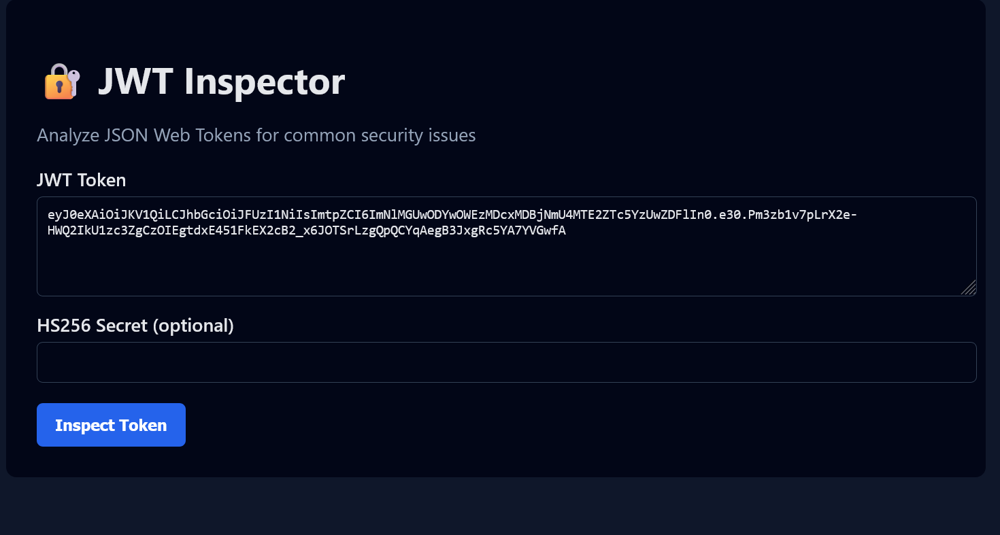
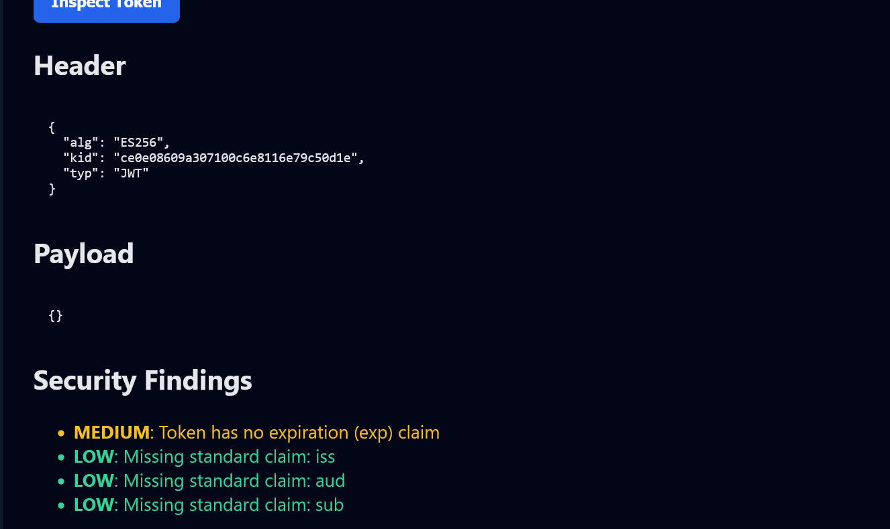

#  JWT Inspector
Open Project in your favorite code editor and run in terminal -
" python jwt-inspector\app.py "
UI should run on your LocalHost or preffered method of running.

JWT Inspector is a lightweight security analysis tool for inspecting JSON Web Tokens (JWTs) and identifying common authentication misconfigurations.

It is designed as:
- a reusable Python security library
- a local web application (Flask)
- a containerized, reproducible security tool (Docker)

It is designed to:

Provide decoding, verification, and security analysis of JWTs.
pyth

Tokens can be generated from: https://www.scottbrady.io/tools/jwt

---
SCREENSHOTS
---

##  Why JWT Inspector Exists

JWT misconfigurations are a frequent cause of:
- authentication bypass
- privilege escalation
- broken session handling

JWT Inspector helps developers and security professionals:
- understand JWT internals
- identify insecure token configurations
- safely analyze tokens in an isolated environment

---

##  Features

- Decode JWT headers and payloads
- Detect insecure algorithms (`alg=none`)
- Identify expired or non-expiring tokens
- Highlight missing standard claims (`iss`, `aud`, `sub`)
- Verify HS256 signatures (optional secret)
- Clean web UI for interactive analysis
- Fully containerized for safe execution

---

## Architecture Overview

jwt-inspector/
├── README.md
├── inspector/
│   ├── __init__.py
│   ├── jwt_inspector.py
│   ├── risks.py
│   └── utils.py
├── samples/
│   ├── weak_hs256.jwt
│   ├── expired.jwt
│   └── none_alg.jwt
├── tools/
│   ├── java-token-generator/
│   │   └── TokenGenerator.java
│   └── cpp-token-generator/
│       └── token_generator.cpp
└── requirements.txt
